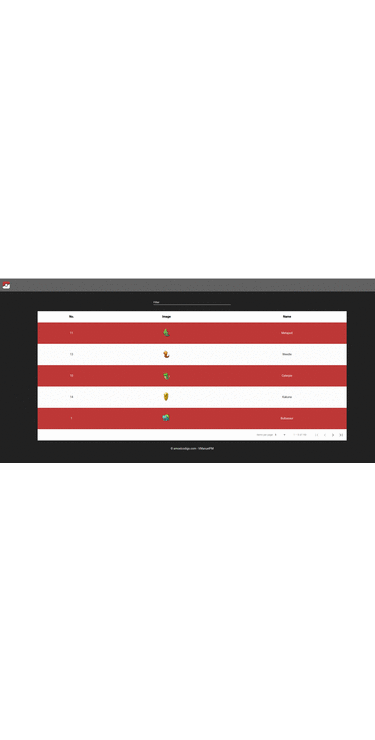

# PokeApp with Angular Material

Projecto creado por https://amoelcodigo.com/
Dockerizado por Softx0

Angular aplication that uses pokeapi:
https://pokeapi.co/docs/v2#pokemon-section

# Running local
 - npm install 
 - "ng serve -o" or "ng serve"
